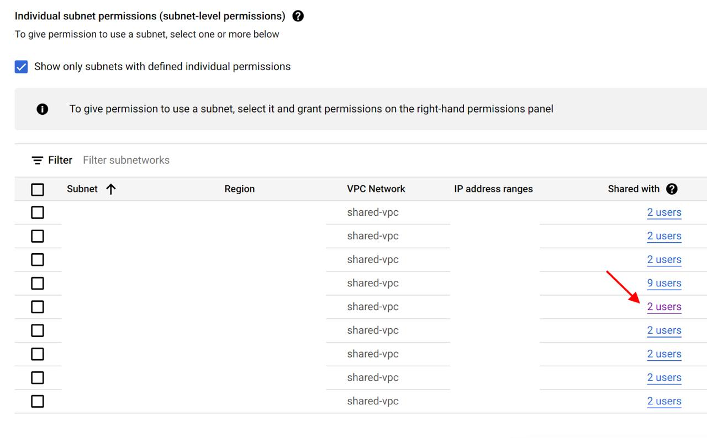
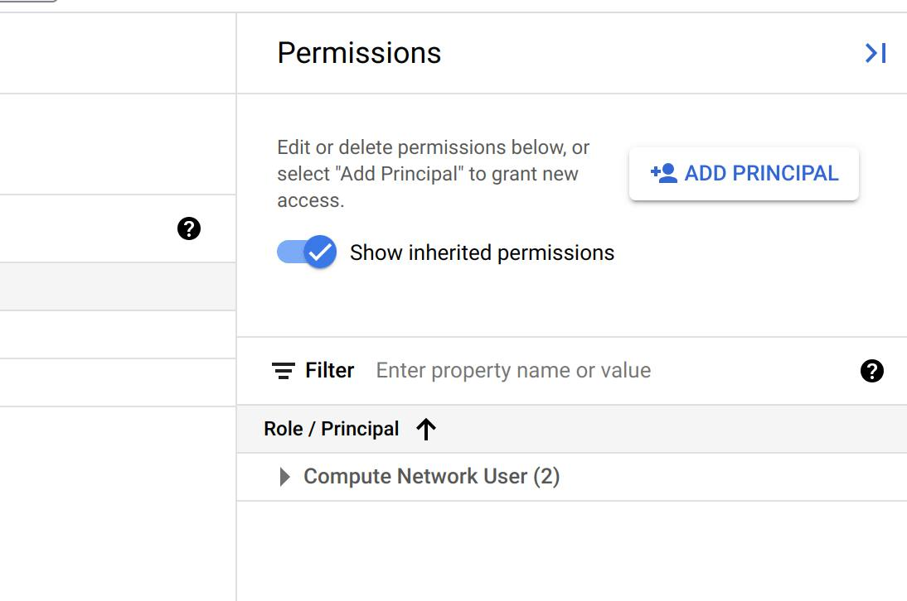

# TeamCity Google Cloud Agents 

[](https://confluence.jetbrains.com/display/ALL/JetBrains+on+GitHub)
[/statusIcon.svg)](https://teamcity.jetbrains.com/viewType.html?buildTypeId=TeamCityGoogleCloudAgent_Build&guest=1)

TeamCity integration with Google Compute Engine which allows using cloud instances to scale the pool of build agents.

## Compatibility

The plugin is compatible with TeamCity 10.0.x and greater.

## Installation

You can [download the plugin](https://plugins.jetbrains.com/plugin/9704-google-cloud-agents) and install it as an [additional TeamCity plugin](https://confluence.jetbrains.com/display/TCDL/Installing+Additional+Plugins).

## Configuration

For configuration details please take a look at the [TeamCity Google Cloud plugins](https://blog.jetbrains.com/teamcity/2017/06/run-teamcity-ci-builds-in-google-cloud/) blog post.

The plugin supports Google Compute images to start new instances. You also need to create a new JSON private key and assign the `Compute Engine Instance Admin (v1)` and `Project Viewer` [roles](https://cloud.google.com/compute/docs/access/#predefined_short_product_name_roles) or create your own with a following permissions:
* `compute.images.list`
* `compute.instances.create`
* `compute.instances.list`
* `compute.instances.setMetadata`
* `compute.machineTypes.list`
* `compute.diskTypes.list`
* `compute.networks.list`
* `compute.subnetworks.list`
* `compute.zones.list`

**Note**: If you're using "Instance template" image type also assign a `Service Account User` role.

To verify whether your service account has all required permissions please enable [Google Cloud Resource Manager API](https://console.cloud.google.com/apis/api/cloudresourcemanager.googleapis.com/overview) in your project.

### Shared VPC permissions configuration

There is 3 ways to configure permissions for shared VPC:

1. In order to see networks and subnetworks in dropdowns in the "Add Image" dialog, you have to add the  `Compute Network User` role to the ServiceAccount under which VMs are created from TeamCity in the Host GCP project with Shared VPC.
2. You can select a limited number of subnetworks that your ServiceAccount should have access to. In Google Cloud Console go to the Host Project -> Shared VPC tab, select the subnet you want to grant access to and add the `Compute Network User` role to the account. In this case, you won't see networks and subnetworks (except for those that don't require any permissions), but you can specify subnet manually. The subnet must be specified in the following format:
`projects/[project_id]/regions/[region]/subnetworks/[subnet_id]`
    

    

    

3. In the case when it is necessary to show some specific subnets, first you need to do p.2, and then add the `Compute Network Viewer` role to the ServiceAccount in IAM to the Host Project with Shared VPC.

### Image Creation

Before you can start using the integration, you need to create a new cloud image. To do that, create a new cloud instance, install the [TeamCity Build Agent](https://confluence.jetbrains.com/display/TCDL/TeamCity+Integration+with+Cloud+Solutions#TeamCityIntegrationwithCloudSolutions-PreparingavirtualmachinewithaninstalledTeamCityagent) on it and set it to start automatically. You also need to manually point the agent to the existing TeamCity server with the Google Cloud plugin installed to let the build agent download the plugins.

Then you need to [remove temporary files](https://confluence.jetbrains.com/display/TCDL/TeamCity+Integration+with+Cloud+Solutions#TeamCityIntegrationwithCloudSolutions-Capturinganimagefromavirtualmachine) and [create a new image](https://cloud.google.com/compute/docs/images/create-delete-deprecate-private-images) from the instance disk.

### Startup and shutdown scripts

To specify instance metadata you could the "Custom metadata" property in cloud image settings. It could be useful while defining [startup](https://cloud.google.com/compute/docs/startupscript) and [shutdown](https://cloud.google.com/compute/docs/shutdownscript) scripts.

#### Preemptible instance

If you are using preemptible instances you have to specify [shutdown script](https://cloud.google.com/compute/docs/instances/create-start-preemptible-instance#handle_preemption) to gracefully reschedule build from preempted VM on another build agent like that.

For Linix instances:
```json
{
  "shutdown-script": "#! /bin/bash\n/opt/buildagent/bin/agent.sh stop force"
}
```

For Windows instances:
```json
{
  "windows-shutdown-script-cmd": "C:\\BuildAgent\\bin\\agent.bat stop force"
}
```

## License

Apache 2.0

## Feedback

Please feel free to post feedback in the repository issues.
